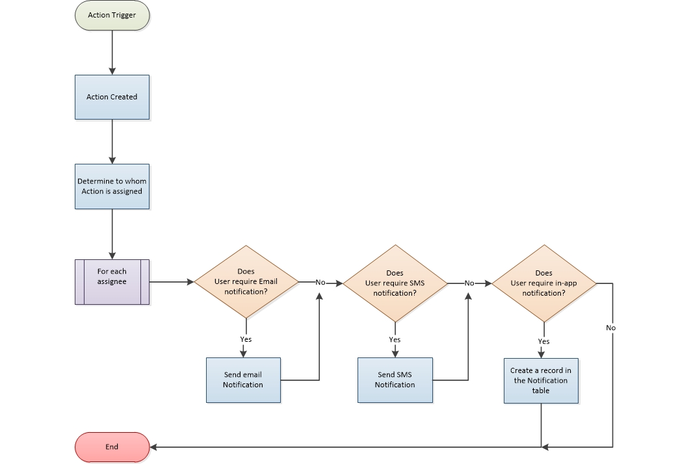

# Notifications

*requires editing*

Note that if you edit the Notification settings for an existing Action Type (e.g. turn off email notifications), this will only affect new User accounts created after that time. The Notifications settings for existing Users will not be overwritten by a change in System Configuration, since Users can set their own personalised Notification preferences.

